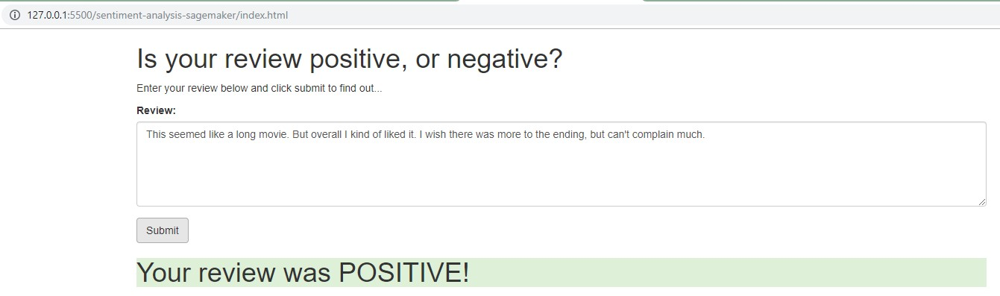

## Project Overview

As part this project, I used the AWS SageMaker service to model, train and deploy an sentiment analysis model, that predicts Positive/Negative sentiment of movie reviews from IMDB. 

As part of the this project, I was able to achieve following tasks:

1. Create a LSTM based RNN Model, in SageMaker.
2. Train the model, using the training job instances on SageMaker.
3. Deploy the model on SageMaker endpoint.
4. Expose the trained endpoint via AWS Lambda and AWS API Gateway.
5. Simple web app that communicates with the API gateway to call the model endpoint.