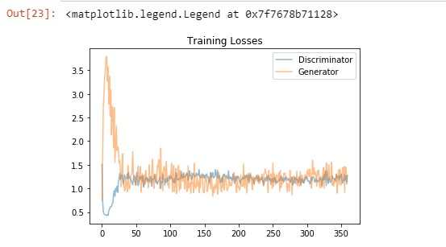
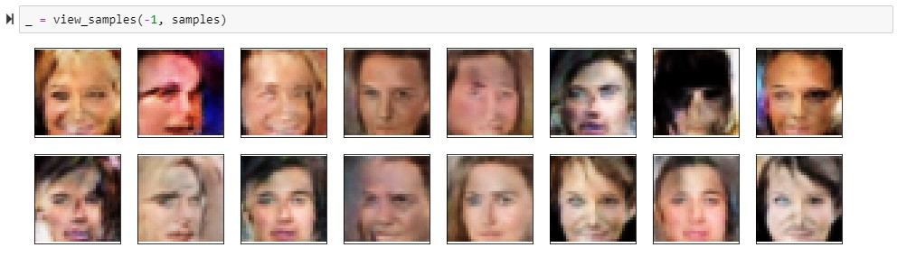

# Faces Generation ( Using DCGANs)

## Project Overview
As part of this project, I built a DCGAN (Deep Convolutional Generative Adversarial Network) that learns to generate new human faces. The DCGAN, consist of a discriminator and a generator, that work as adversarial to each other. The discriminator works as a classifier for real images and fake images produced by generator. In doing so, the generator is getting trained to produce images that get classifed as real images. 
As the models trains, the generator gets better and better at generating images that are closer to real images.

As part of the this project, I was able to achieve following tasks:

1. Explore and understand the concept of GANs and the potential of DCGANs.

2. Implemented a fully functional DCGAN, including the discrimator model and the generator models,  using deep neural networks. 

3. By training the model for 30 epochs, the losses from generator and discriminators were converging, there by improving the features and making images sharper.

## Training Losses graph

## Sample output (after just 30 epochs)

## Project Files
1. The project folder contains:
    1. dlnd_face_generation.ipynb file, which is the Jupyter Notebook file for the project. It contains all the code and output from the project.
    2. dlnd_face_generation.html file, which is the Jupyter Notebook executed and saved output.
    3. problem_unittest.py, which are unittests used for this project.

2. The dataset used for project can be found in [processed-celeba-small.zip](https://s3.amazonaws.com/video.udacity-data.com/topher/2018/November/5be7eb6f_processed-celeba-small/processed-celeba-small.zip).

3. Make sure you already have a working python environment, with all the usual packages (Numpy, pytorch, jupyter).

6. Open the dlnd_face_generation.ipynb notebook and follow the instructions.
	